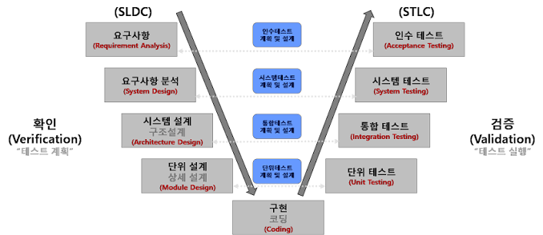

# 소프트웨어 테스트 개요

## 1. 애플리케이션 테스트 기본 원리

- **테스트는 결함이 존재함을 밝히는 활동**
  - 테스트를 통해 결함이 있음을 발견할 수는 있지만, 결함이 전혀 없음을 완전히 증명할 수는 없다.
- **완벽한 테스트는 불가능**
  - 모든 경우의 수를 전부 테스트할 수 없으므로, 무한 입력값을 모두 검증할 수 없다.
- **결함 집중 (Defect Clustering)**
  - 결함은 특정 모듈에 집중되는 경향이 있다.
  - **파레토(Pareto) 법칙**: 전체 결함의 약 80%가 전체 모듈의 약 20%에서 발생한다.
- **살충제 패러독스 (Pesticide Paradox)**
  - 동일한 테스트 케이스만 반복하면 새로운 결함을 발견하기 어려워진다.
  - 따라서 테스트 케이스를 지속적으로 보완해야 한다.
- **오류-부재의 궤변 (Absence-of-Errors Fallacy)**
  - 결함이 거의 없더라도 사용자의 요구사항을 만족하지 못하면 좋은 소프트웨어라고 할 수 없다.
- **Brooks의 법칙**
  - 일정이 지연된 프로젝트에 인력을 추가 투입하면 오히려 더 지연될 수 있다.

---

## 2. 애플리케이션 테스트 분류

### 2.1 프로그램 실행 여부 기준

| 구분 | 설명 | 예시 |
|---|---|---|
| **정적 테스트** | 프로그램을 실행하지 않고 명세서, 소스 코드 등을 분석 | 동료 검토, 워크스루, 인스펙션, 코드 검사 |
| **동적 테스트** | 프로그램을 실제로 실행하여 오류를 검사 | 화이트박스 테스트, 블랙박스 테스트 |

### 2.2 테스트 기반 기준

| 구분 | 설명 | 예시 |
|---|---|---|
| **명세 기반 테스트** | 사용자의 요구사항 명세를 바탕으로 테스트 케이스 구현 여부 확인 | 동등 분할, 경계값 분석 |
| **구조 기반 테스트** | 소프트웨어 내부 논리 흐름에 따라 테스트 케이스 작성 및 확인 | 구문 기반, 결정 기반, 조건 기반 |
| **경험 기반 테스트** | 테스터의 경험을 기반으로 수행 | 에러 추정, 체크리스트, 탐색적 테스트 |

### 2.3 목적 기준

| 구분 | 설명 |
|---|---|
| **회복(Recovery) 테스트** | 시스템에 인위적으로 결함을 부여한 뒤 정상적으로 복구되는지 확인 |
| **안전(Security) 테스트** | 외부의 불법 침입으로부터 시스템을 보호할 수 있는지 확인 |
| **강도(Stress) 테스트** | 과부하 상태에서 소프트웨어가 정상 동작하는지 확인 |
| **성능(Performance) 테스트** | 실시간 성능 및 전체적인 효율성을 진단. 응답 시간, 처리량 등을 확인 |
| **구조(Structure) 테스트** | 소프트웨어 내부 논리적 경로 및 소스 코드 복잡도 평가 |
| **회귀(Regression) 테스트** | 변경 또는 수정된 코드에 새로운 결함이 발생하지 않았는지 확인 |
| **병행(Parallel) 테스트** | 변경된 소프트웨어와 기존 소프트웨어에 동일한 데이터를 입력하여 결과 비교 |

---

## 3. 관점에 따른 테스트

| 구분 | 관점 | 설명 | 예시 |
|---|---|---|---|
| **검증(Verification)** | 개발자 | 제품의 생산 과정이 올바른지 확인 | 단위 테스트, 통합 테스트, 시스템 테스트 |
| **확인(Validation)** | 사용자 | 완성된 제품이 사용자의 요구를 만족하는지 확인 | 인수 테스트(알파, 베타) |

### 기억하기

- **Verification**: 제품을 **올바르게 만들고 있는가?**
- **Validation**: **올바른 제품을 만들었는가?**

---

## 4. 소프트웨어 생명주기와 테스트 — V 모델

개발 단계와 테스트 단계는 다음과 같이 대응된다.

| 개발 단계 | 대응 테스트 | 확인 대상 |
|---|---|---|
| 요구사항 | 인수 테스트 | 요구사항 충족 여부 |
| 분석 | 시스템 테스트 | 시스템 전체 기능 |
| 설계 | 통합 테스트 | 모듈 간 인터페이스 |
| 구현 | 단위 테스트 | 개별 모듈 기능 |

---

## 5. 개발 단계에 따른 테스트

### 5.1 단위 테스트 (Unit Test)

- 소프트웨어의 최소 단위인 **모듈/컴포넌트**를 대상으로 수행
- 주로 **구조 기반 테스트**
- 기능성 테스트를 우선 수행

### 5.2 통합 테스트 (Integration Test)

- 단위 테스트가 끝난 모듈을 통합하는 과정에서 발생하는 오류 및 결함을 확인
- 핵심은 **모듈 간 인터페이스가 정상적으로 동작하는지 확인**하는 것

#### 하향식 통합 테스트 (Top-down)

- 상위 모듈에서 하위 모듈 방향으로 통합
- **깊이 우선(Depth First)** 또는 **너비 우선(Breadth First)** 방식 사용
- 아직 구현되지 않은 하위 모듈 대신 **스텁(Stub)** 사용
  - 스텁: 하위 모듈의 기능을 단순하게 흉내 내는 임시 모듈

#### 상향식 통합 테스트 (Bottom-up)

- 하위 모듈에서 상위 모듈 방향으로 통합
- 관련된 하위 모듈을 묶은 **클러스터(Cluster)** 단위로 테스트
- 상위 제어 모듈 대신 **드라이버(Driver)** 사용
- **스텁은 사용하지 않는다**

### 5.3 시스템 테스트 (System Test)

- 개발된 소프트웨어가 전체 시스템 내에서 정상적으로 동작하는지 점검
- 실제 사용 환경과 유사한 테스트 환경에서 수행
- **기능적 테스트**와 **비기능적 테스트**로 구분

### 5.4 인수 테스트 (Acceptance Test)

사용자의 요구사항 충족 여부를 확인한다.

- **알파 테스트**
  - 통제된 개발 환경에서
  - 사용자가 개발자와 함께 확인
- **베타 테스트**
  - 개발자가 통제하지 않는 실제 사용 환경에서
  - 여러 사용자가 직접 검증

---

## 6. 테스트 관련 용어

### 테스트 시나리오 (Test Scenario)

- 테스트 케이스를 적용하거나 동작시키는 순서에 따라
- 여러 테스트 케이스를 하나의 묶음으로 구성한 것

### 테스트 오라클 (Test Oracle)

- 테스트 결과가 맞는지 판단하기 위해 사용하는 **사전에 정의된 참값**

#### 테스트 오라클 종류

| 종류 | 설명 |
|---|---|
| **참 오라클(True Oracle)** | 모든 테스트 케이스 입력값에 대해 기대 결과 제공 |
| **샘플링 오라클(Sampling Oracle)** | 특정 테스트 케이스 입력값에 대해서만 기대 결과 제공 |
| **추정 오라클(Heuristic Oracle)** | 특정 테스트 케이스의 기대 결과를 제공하고, 나머지는 추정 결과 제공 |
| **일관성 오라클(Consistent Oracle)** | 테스트 수행 전후 결과값이 동일한지 확인 |
